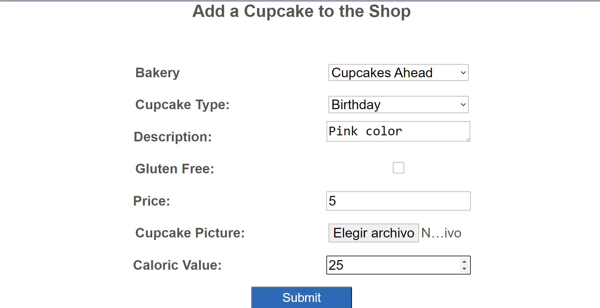

# Using-Entity-Framework-Core-in-ASP.NET-Core

Creación de una página para una pastelería, con la opción de mofificar y añadir los productors, indicando nombre, característacas valor calórico etc.  

*Resultado:*   
* Cabecera:

* Productos:   

* Adición de producto: 

